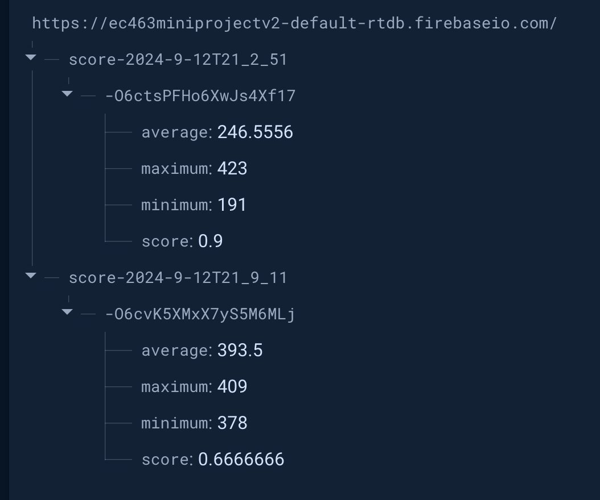

# Question Answers

# Exercise 1: applications of analog input

1. What are the "max_bright" and "min_bright" values you found?

   The value for "max_bright" was 53600 and the value for "min_bright" was 460.
   
   [Link to Pi running exercise_light.py, light values changing on Thonny based on extreme (light/dark) exposure](https://drive.google.com/file/d/1lmQHyUK9U_8Z4o5gfOX9NQN8-uoS1qvC/view?usp=sharing).
    

# Exercise 2: PWM sound output

1. Using the code in exercise_sound.py as a starting point, modify the code to play several notes in a sequence from a song of your choosing.
    The code plays "Happy Birthday."
    [Link to Pi playing Happy Birthday](https://drive.google.com/file/d/1wWi8ZwWhAkjoc05ARjKiIBn__7dpbHJv/view?usp=sharing).

# Exercise 3: Response time measurement and cloud upload

1. Edit the exercise_game.py code to compute average, minimum, maximum response time for 10 flashes total.
2. Upload the response time data to a cloud service of your choice.
   [Link to Pi game executing and showing realtime cloud data upload. Please note we only ran 3 iterations for demonstration purposes, the actual game has 10 flashes.](https://drive.google.com/file/d/1cw-YptZYSptJHWm04gG8aB3Lu4MxcZ4U/view?usp=drive_link).

   The above video shows this game run "score-2024-9-12T21_9_11" uploading the minimum, maximum, and average response time and score to the cloud. We can see that previous data is not overwritten and different names separately denote both entries.

   

    
    

    

    Realtime Firebase database upload of the game ran and data obtained in the video above
    

